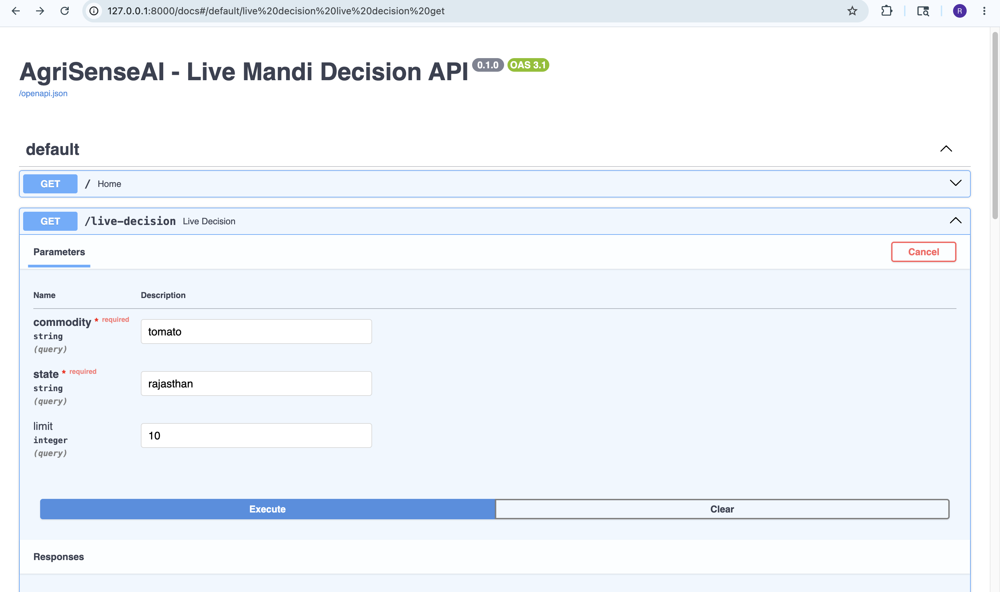
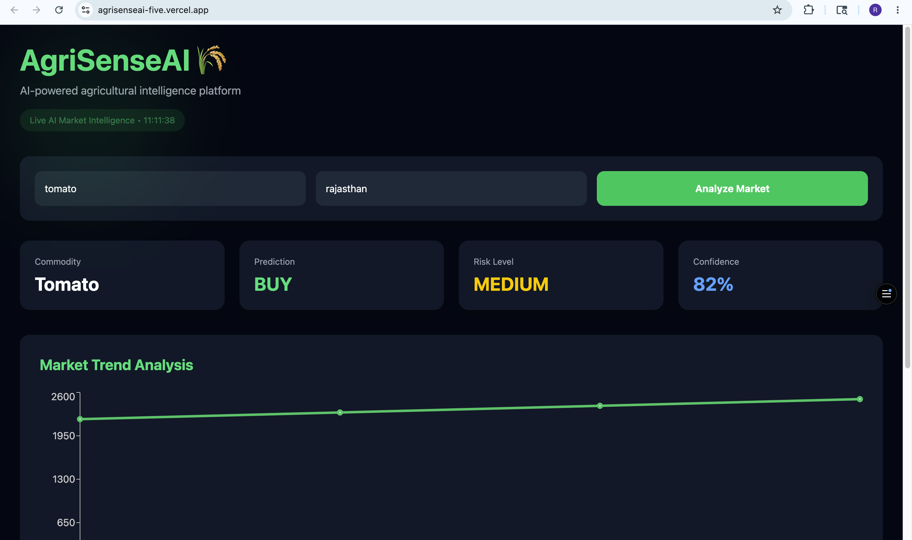
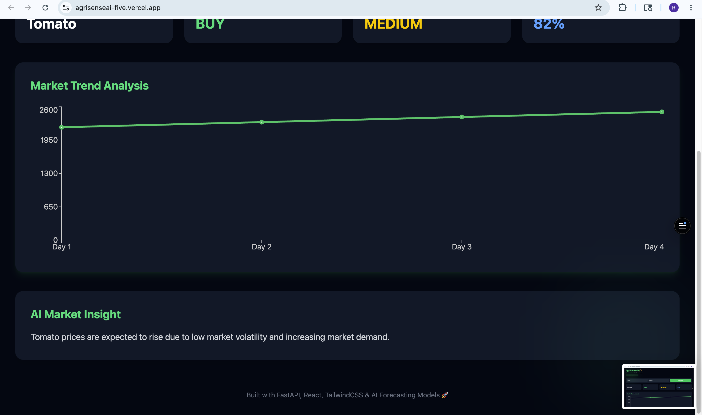

# 🌾 AgriSenseAI

AI-powered agricultural intelligence and forecasting platform built using FastAPI, machine learning forecasting models, and live mandi market data APIs.

---

## Live Demo

https://agrisenseai-five.vercel.app

# 🚀 Overview

AgriSenseAI helps analyze agricultural market trends using AI-driven forecasting and risk analysis techniques.

The platform fetches live mandi price data from Indian government APIs, performs forecasting using Prophet, evaluates market volatility and risk, and generates intelligent BUY / HOLD / SELL recommendations for agricultural commodities.

---

# ✨ Features

- 📈 AI-powered price forecasting
- ⚠️ Risk analysis and volatility scoring
- 🌍 Live mandi market price integration
- 🤖 Intelligent BUY / HOLD / SELL recommendations
- ⚡ FastAPI REST backend
- 📊 Swagger API documentation
- 🛡️ Graceful timeout and exception handling
- 🔄 Fallback handling for unavailable API data

---

# 🛠️ Tech Stack

## Backend
- FastAPI
- Python

## Machine Learning
- Prophet Forecasting
- Pandas
- NumPy

## APIs
- Government Open Data APIs
- Requests Library

## Development Tools
- Uvicorn
- Swagger UI
- Git & GitHub

---

# 🧠 AI Pipeline

```text
User Request
      ↓
FastAPI Backend
      ↓
Fetch Live Mandi Prices
      ↓
Forecasting Model (Prophet)
      ↓
Risk & Volatility Analysis
      ↓
AI Decision Engine
      ↓
BUY / HOLD / SELL Recommendation
```

---

# 🏗️ Project Architecture

```text
Frontend Dashboard (Planned)
           ↓
     FastAPI Backend
           ↓
     Decision Engine
       ↙        ↘
Forecasting    Risk Analysis
           ↓
   Government Mandi APIs
```

---

# 📁 Project Structure

```bash
AgriSenseAI/
│
├── assets/
│   ├── swagger.png
│   ├── dashboard.png
│   ├── analysis.png
│   └── chart.png
│
├── backend/
│   ├── app.py
│   ├── decision_engine.py
│   ├── forecast_model.py
│   ├── mandi_api.py
│   ├── risk_model.py
│   ├── requirements.txt
│   └── Procfile
│
├── frontend/
│   ├── public/
│   ├── src/
│   │   ├── App.jsx
│   │   ├── main.jsx
│   │   ├── index.css
│   │   └── assets/
│   │
│   ├── package.json
│   ├── vite.config.js
│   └── index.html
│
├── ml/
│   └── notebooks/
│
├── .gitignore
└── README.md
```

---

# 📡 API Endpoints

## Home Route

```http
GET /
```

Returns API status.

---

## Live Decision Endpoint

```http
GET /live-decision
```

### Query Parameters

| Parameter | Type | Description |
|---|---|---|
| commodity | string | Commodity name |
| state | string | State name |
| limit | integer | Number of records |

### Example

```http
/live-decision?commodity=tomato&state=rajasthan&limit=10
```

---

# 📷 Swagger API Documentation

FastAPI automatically generates interactive API documentation.

Access locally:

```text
http://127.0.0.1:8000/docs
```

---

# ⚙️ Run Locally

## Clone Repository

```bash
git clone https://github.com/RishitaBohra/AgriSenseAI.git
```

---

## Navigate to Backend

```bash
cd AgriSenseAI/backend
```

---

## Create Virtual Environment

```bash
python3 -m venv venv
```

---

## Activate Virtual Environment

### Mac/Linux

```bash
source venv/bin/activate
```

### Windows

```bash
venv\Scripts\activate
```

---

## Install Dependencies

```bash
pip install -r requirements.txt
```

---

## Run Backend

```bash
python -m uvicorn app:app --reload
```

---

# 🔮 Future Improvements

- React analytics dashboard
- Interactive forecasting charts
- Weather API integration
- Historical data storage
- MongoDB/PostgreSQL integration
- Authentication system
- Deployment on Render/Vercel
- AI-generated market insights
- Model caching and optimization

---

# 📌 Current Status

✅ FastAPI backend running  
✅ AI forecasting pipeline integrated  
✅ Swagger API documentation available  
✅ Live mandi API integration implemented  
✅ Graceful timeout handling added  
🚧 Frontend dashboard under development

---

# 📷 Swagger API Documentation


# 📷 Frontend Dashboard


# 📷 Swagger API Documentation


# 👩‍💻 Author

Rishita Bohra

---

# ⭐ Future Vision

AgriSenseAI aims to evolve into a complete agricultural intelligence platform capable of helping farmers, traders, and analysts make data-driven decisions using AI and real-time market insights.